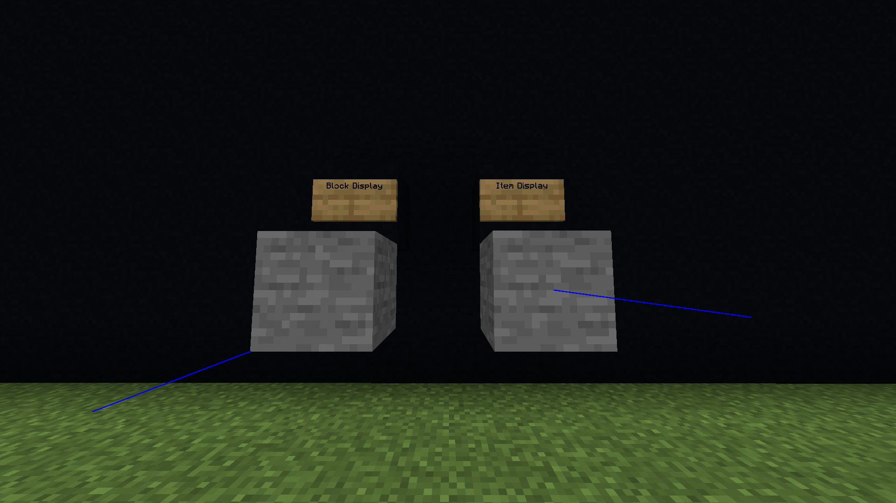

# XDisplays
A simple plugin to add command based support for the new 1.19.4 Block and Item Displays

### Features
- A simple command interface to interact with Block and Item Displays

### Requirements
- This plugin has one dependency: [ServerUtils](https://www.spigotmc.org/resources/serverutils.106515/) v1.0.2

### Commands
 - The base command is `xdisplay` (alias `xd`) with permission `xdisplay.admin`
 - Subcommands do not require any permission besides the one listed above
 - `/xd help` Opens the help menu
 - `/xd brightness <all|block|sky> <amount>` Change the brightness of your selected display
 - `/xd clone` Clone your selected display
 - `/xd create <type> [material]` Create a new display
 - `/xd delete` Delete your selected display
 - `/xd glow [range] [seconds]` Make nearby displays glow
 - `/xd item <get|set>` Get or set the item of an item display
 - `/xd material <material>` Change your selected display's material
 - `/xd move <x> <y> <z>` Move this display (accepts `~` in the x/y/z arguments like teleport commands)
 - `/xd reset [arg]` Reset properties of the display
 - `/xd rotate <x> <y> <z>` Rotate this display by adding degrees to each axis (using the left internal rotation)
 - `/xd select [range]` Select the closest display to you
 - `/xd setInterpolationDelay <ticks>` Change the interpolation delay
 - `/xd setInterpolationDuration <ticks>` Change the interpolation duration
 - `/xd size [size] [y-size] [z-size]` Change or view display size
 - `/xd select [range]` Select the closest display to you
 - `/xd tph <copyRotation>` Teleport display to you (if copyRotation=true then it will copy your pitch and yaw)
 - `/xd transform <x,y,z> <x,y,z> <x,y,z> <x,y,z>` Transform the display

### Rotation Tutorial
 - Generally, you will want to rotate the display on one axis at a time
   - For example, `/xd rotate 90 0 0` would do a 1/4 rotation on the x-axis
 - Block displays rotate along their corner. They will change location when rotating!
 - Item displays rotate along their center. Their location will not change when rotating!

### Notes
 - The default size of all displays is `1.0`
   - To match the size of a block use `1.0`
   - To match the size of an item use `0.5`
 - This plugin has no support for Text Displays. You should use a hologram plugin for it
 - This plugin has no support for Interaction entities
 - Check out the [Spigot API](https://hub.spigotmc.org/javadocs/spigot/org/bukkit/entity/Display.html) for more information about the new Display entity